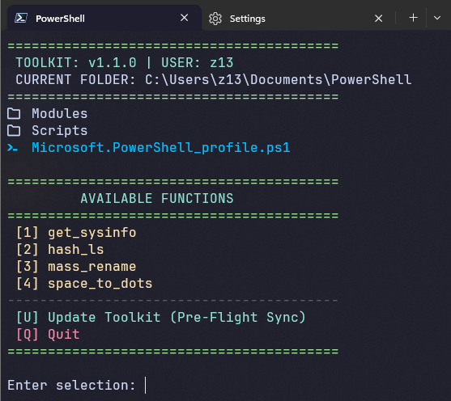
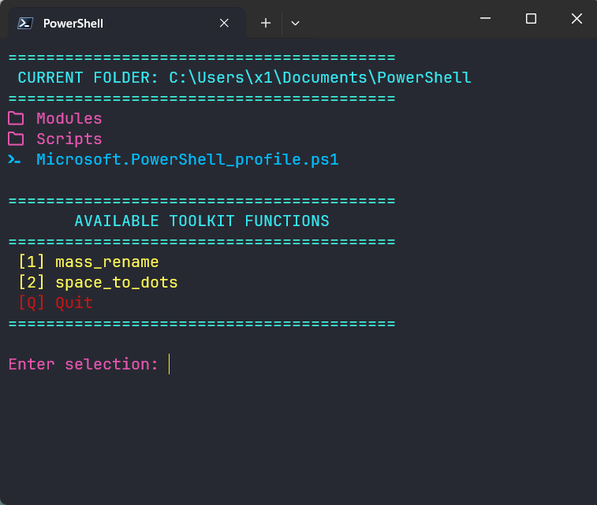
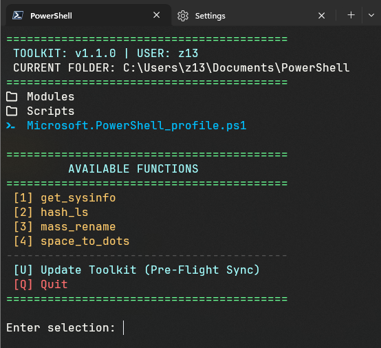
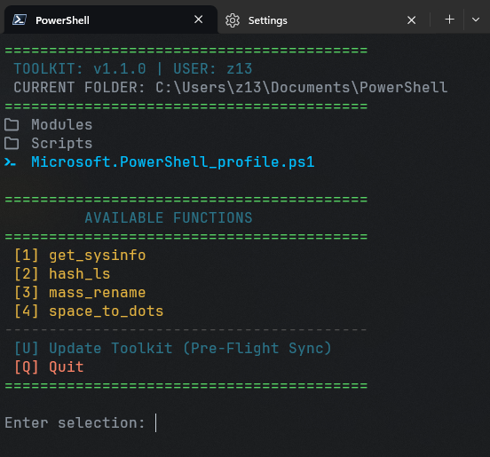
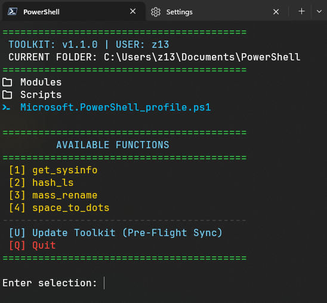
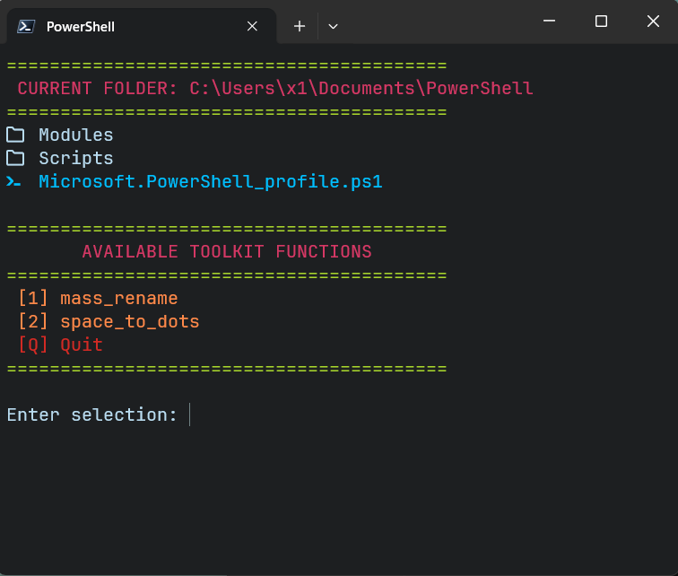
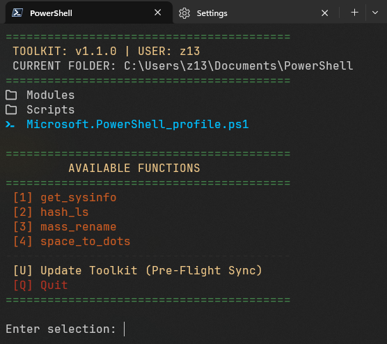
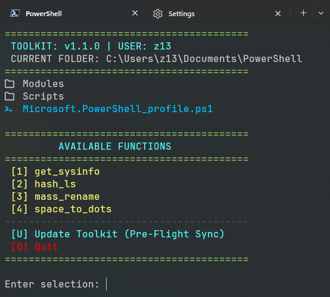
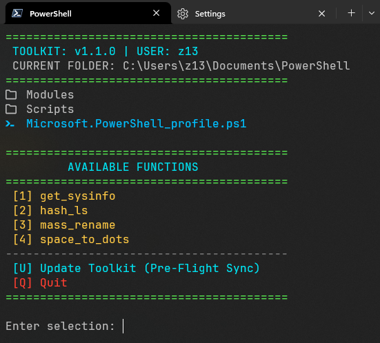
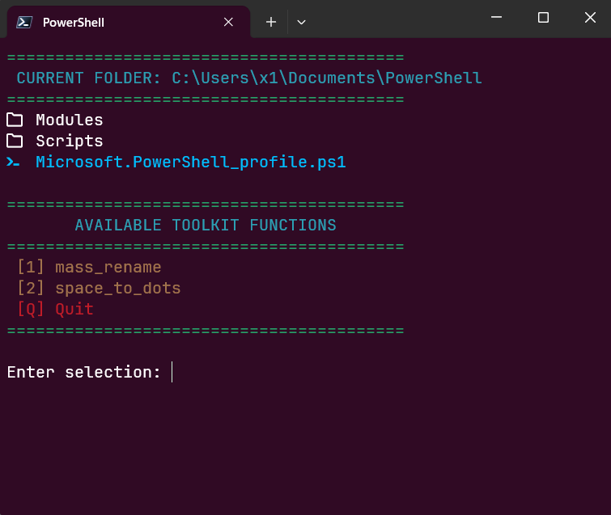

# 🛠️ PowerShell Core IT Toolkit

A portable, "one-click" deployment script designed to standardize a PowerShell 7 environment across multiple machines. This toolkit automates folder structures, installs visual enhancements, and provides a custom interactive menu for common IT tasks.

> [!IMPORTANT]
> **Requirements:** This script requires **PowerShell 7+** and **Administrator Privileges** for the initial setup.

---

## 🚀 Quick Start

> [!WARNING]
> **Do not "Right-Click > Run with PowerShell"**. This will attempt to run the script in Windows PowerShell 5.1, which is incompatible with this toolkit.

### Correct Installation Steps:

1. **Open PowerShell 7+** as an Administrator.
2. **Navigate** to the folder containing your downloaded files:

```powershell
cd C:\Path\To\Your\Downloads\Powershell-Toolkit
```

3. **Execute** the script by typing:

```powrshell
.\Setup.ps1
```

4. **Follow the Interactive Prompts: Choose your themes and opacity settings.**
5. **Restart your Terminal to load the new** `$PROFILE` **and UI enhancements.**

## ⚡ Instant Installation (Pro Way)

If you have **PowerShell 7** installed and want to skip the manual download, copy and paste this command into an **Administrator** terminal:

```powershell
pwsh -ExecutionPolicy Bypass -Command "iex (New-Object System.Net.WebClient).DownloadString('[https://raw.githubusercontent.com/padou-dev/Powershell-Toolkit/main/Setup.ps1](https://raw.githubusercontent.com/padou-dev/Powershell-Toolkit/main/Setup.ps1)')"
```

## 🎨 Customization Options

During installation, you will have the choice to opt-in to the following:

### 🌈 Professional Color Schemes
Injects 8 high-quality themes into your Windows Terminal settings without overwriting your existing profiles:
* **Catppuccin Mocha** (Modern Dark)
* **CyberPunk 2077** (High Contrast)
* **Dracula+** & **Obsidian** (Classic Developer Favorites)
* **Apple & Ubuntu** (System-inspired palettes)
* **GitHub Dark** & **Hacktober**

### 🪟 UI Transparency
* **92% Opacity:** Applies a subtle, professional transparency to all terminal profiles for a modern "Glass" aesthetic.

---

## 🎨 Theme Gallery

Take a look at the curated color schemes included in this toolkit. All screenshots feature the interactive `menu` command with **Terminal-Icons** enabled and the JetBrains Mono font installed.

<table align="center">
  <tr>
    <td align="center"><b>Catppuccin Mocha</b><br></td>
    <td align="center"><b>CyberPunk 2077</b><br></td>
  </tr>
  <tr>
    <td align="center"><b>Dracula+</b><br></td>
    <td align="center"><b>GitHub Dark</b><br></td>
  </tr>
</table>

<details>
<summary><b>📸 Click to see all 10 themes...</b></summary>
<br>

| Theme Name | Preview |
| :--- | :--- |
| **Apple System Colors** |  |
| **Flatland** |  |
| **Hacktober** |  |
| **Obsidian** |  |
| **Ottosson** |  |
| **Ubuntu** |  |

</details>

---

## 📦 What this Toolkit Does

### 1. Environment Standardization
The script automatically configures your `$PROFILE` (the script that runs every time you open PowerShell) with the following:
* **Terminal-Icons:** Adds file-type icons to your directory listings.
* **PSReadLine:** Optimized for efficiency with `MenuComplete` enabled on the **Tab** key.
* **Auto-Loader:** Dynamically "dot-sources" any `.ps1` script found in the toolkit folder, making your custom functions available immediately by name.
* **Alias:** Creates the `menu` command as a shortcut to the interactive manager.

### 2. Interactive Menu (`menu`)
By typing `menu` from any directory, you get a high-visibility dashboard:
* **File Explorer:** Displays the contents of your current folder with icons.
* **Function Picker:** Lists all available scripts in your `Documents\PowerShell\Scripts\Functions` folder.
* **Execution:** Simply type the number of the script you want to run.

---

## 🛠️ Included Functions

### `mass_rename`
A safe, preview-first renaming tool. 
* **How it works:** Prompts for a specific string to find and a string to replace.
* **Safety:** It displays a preview of all changes and asks for confirmation (`y/n`) before touching any files on disk.

### `space_to_dots`
A cleanup utility for terminal-friendly filenames.
* **How it works:** Replaces all spaces in filenames within the current directory with periods (`.`). 
* **Use Case:** Perfect for preparing files for web hosting or Linux-based environments where spaces cause syntax issues.

---

## 🎨 Visual Requirements
To see the icons correctly, you must use a **Nerd Font**.
1. Download a font (e.g., *JetBrains Mono Nerd Font*) from [nerdfonts.com](https://www.nerdfonts.com).
2. Install it on Windows.
3. Open Terminal Settings (`Ctrl + ,`) > **Profiles** > **Defaults** > **Appearance** > Set **Font face** to your chosen Nerd Font.

---

## 📂 File Structure
After setup, your files will be organized as follows:
* `Documents\PowerShell\Scripts\` - Contains the main `Menu.ps1`
* `Documents\PowerShell\Scripts\Functions\` - Stores your individual `.ps1` function files.
